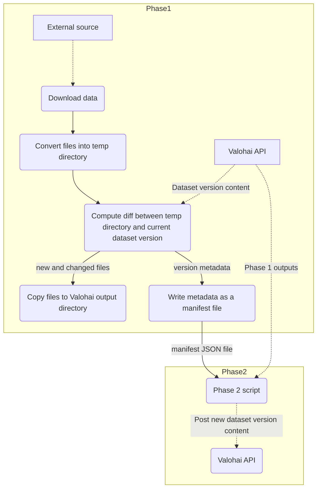

# dataset-update-example

This is a small example of how to update a Valohai dataset version
from an external source with only the files changed since the latest version.

> [!NOTE]
> This is meant as an "user-space" proof-of-concept to validate whether this approach
> would work; the plan is to provide a more fluent API to do this on Valohai's side.

The conceptual flow this is targeting is

At present, diffing is done based on file size and checksums when available.
This can be changed as necessary.

The example project does not have any external source,
but instead uses the `new-file-names` and `new-file-contents`
parameters to simulate it. The values of `new-file-contents` are repeated in a round-robin
manner over the files in `new-file-names`.

## Usage (example)

1. Set up a Valohai project with the environment variable `VH_API_TOKEN` set to a valid API token.
2. Set up a dataset accessible to that project; take a note of that dataset's ID (and substitute it in the commands below).
3. Link this directory to that project.
4. Run an initial execution:
   - `vh exec run --adhoc Phase1 --open-browser--dataset-id=DATASET_ID`
   - This execution outputs `file1.csv`, `file2.csv`, `file3.csv` and `_dataset-manifest.json`.
   - The contents of the data are `foofoo`, `barbar`, `foofoo`, respectively.
5. Find out the datum ID of the uploaded `_dataset-manifest.json` and run the Phase2 execution.
   - `vh exec run --adhoc Phase2--open-browser --manifest datum://01922e7a-aaaa-aaaa-aaaa-dda0bbb8fee2` 
   - This will create a new version in the dataset with the files `file1.csv`, `file2.csv`, `file3.csv`.
6. Run another phase1 execution:
   - `vh exec run --adhoc Update --open-browser --new-file-names=file1.csv --new-file-names=file3.csv --dataset-id=DATASET_ID`
   - This execution outputs the files `file1.csv` and `file3.csv`. `file2.csv` is dropped.
   - The contents of `file1.csv` will be `foofoo`, and the contents of `file3.csv` will be `barbar`.
7. Find out the datum ID of the new uploaded `_dataset-manifest.json` and run the Phase2 execution.
   - `vh exec run --adhoc Phase2--open-browser --manifest datum://01922e7a-bbbb-bbbb-bbbb-babababababa` 
   - This will create a new version in the dataset with the files `file1.csv`, `file3.csv`.
